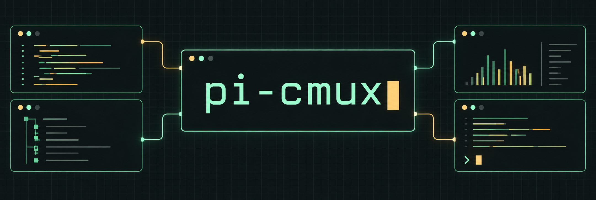

[](https://github.com/javiermolinar/pi-cmux/actions/workflows/ci.yml)
[](https://www.npmjs.com/package/pi-cmux)
[](https://www.npmjs.com/package/pi-cmux)
[](https://pi.dev)
[](https://opensource.org/licenses/MIT)


A [Pi](https://pi.dev) package that turns [cmux](https://www.cmux.dev) into your coding workspace. Start parallel chats, run tools beside your agent, annotate browser pages, and carry a task into a fresh worktree without leaving the terminal.

[Install](#install) · [Capabilities](#capabilities) · [Commands](#commands) · [Configuration](#configuration) · [Usage guide](docs/usage.md)

## Capabilities

- **Parallel Pi sessions.** Start a fresh chat in a named sidebar workspace or split Pi beside your current session.
- **Tools within reach.** Open tests, dev servers, and interactive tools in splits or tabs. Define shortcuts for commands you use often.
- **Browser feedback.** Preview a page beside Pi, select an element, and send a note back after confirming it in Pi.
- **Handoffs with context.** Continue a task in another split or a new branch worktree with handoff context.
- **Quick project jumps.** Start Pi in another directory using a path or a zoxide match.
- **Progress at a glance.** See status, progress, token counts, and logs in the cmux sidebar, with optional cost reporting and notifications.


## Install

Requires Pi **0.85.1 or newer** and Node.js **22.19.0 or newer**. The `pi` executable on your `PATH` must also meet this requirement. Update Pi if needed:

```bash
npm install -g --ignore-scripts @earendil-works/pi-coding-agent@latest
```

Then install the package:

```bash
pi install npm:pi-cmux
```

Or install/update with the package installer:

```bash
npx pi-cmux
```

Run Pi inside cmux to use the integrations. For native notifications, session restore, and prompt previews, install cmux's Pi hooks:

```bash
cmux hooks pi install
```

Package notifications are opt-in to avoid duplicating native hook notifications. Directory matching with `/cmz` and `/cmzh` uses zoxide; explicit paths work without it.

## Commands

| Workflow | Commands | Summary |
|---|---|---|
| Notifications | opt-in | Set `PI_CMUX_NOTIFY_LEVEL=all` to send `cmux notify` once Pi settles after retries, compaction, and queued follow-ups. Only notifies from interactive Pi inside cmux unless forced. |
| Sidebar status/log | automatic | Updates cmux status, progress, and logs while Pi runs, then flashes once Pi settles. |
| New sidebar chat | `/cmn <prompt>` | Starts a fresh Pi chat in a named workspace in the left sidebar. |
| Split Pi | `/cmv [prompt]`, `/cmh [prompt]` | Opens a new right/lower split with Pi in the same project. |
| Run a tool | `/cmo <cmd>`, `/cmoh <cmd>`, `/cmt <cmd>` | Opens a split or tab and runs a shell command in the same project. |
| Open a browser | `/cmb [--down] [--focus] <url>` | Opens a browser beside this Pi terminal; keeps focus in Pi by default. |
| Annotate a page | **Annotate** toggle in the browser | Added automatically, initially off. Select an element and write a note; Send requires confirmation in Pi. |
| Pluggable tools | custom `/<name>` | Registers cmux split shortcuts from `pi-cmux.commands` settings. |
| Jump directory | `/cmz <query>`, `/cmzh <query>` | Resolves a zoxide match or path, then opens Pi there. |
| Continue task | `/cmcv [note]`, `/cmch [note]` | Opens a related handoff session in a split. |
| Continue in worktree | `/cmcv -c <branch> [--from <ref>] [note]` | Creates a branch worktree and starts Pi there with handoff context. |

New Pi sessions and tool terminals preserve the calling Pi process's `PATH`, so executables such as Pi, Node, and Hunk remain discoverable even when cmux has a different terminal environment. Tool commands use an inner `/bin/sh -c`, but cmux 0.64.25 wraps respawns in `/bin/sh -lc`. Login profiles may run before our command restores `PATH`; profile side effects are not prevented. This does not copy the caller's shell aliases or functions.

New workspaces use `cmux --json workspace create`, verified against cmux **0.64.25 (106)**. Creation targets the caller's window and is never automatically retried; if identification or startup fails, inspect cmux before retrying because the workspace may already exist. Older cmux versions have not been verified.

Detailed command examples: [docs/usage.md](docs/usage.md).

## Common examples

```text
/cmn Investigate the slow startup
/cmv Review the auth flow
/cmo npm test
/cmt k9s
/cmb http://localhost:3000
/cmz mono
/cmcv focus on tests
/cmcv -c fix/sidebar --from main
```

## Configuration

| Variable | Default | Purpose |
|---|---:|---|
| `PI_CMUX_NOTIFY_LEVEL` | `disabled` | Opt in with `all`, `medium`, or `low`; leave disabled when using native hook notifications. |
| `PI_CMUX_NOTIFY_FORCE` | `0` | Set `1` to allow final-run and configured tool-start notifications outside interactive cmux sessions. Does not override the notification level. |
| `PI_CMUX_NOTIFY_INCLUDE_RESPONSE` | `0` | Append truncated final assistant response to non-error notifications. |
| `PI_CMUX_NOTIFY_THRESHOLD_MS` | `15000` | Duration threshold for `Task Complete` vs `Waiting`. |
| `PI_CMUX_SIDEBAR` | `1` | Set `0` to disable sidebar integration. |
| `PI_CMUX_SIDEBAR_FLASH` | `all` | `all`, `error`, or `disabled`. |
| `PI_CMUX_SIDEBAR_PROGRESS` | `1` | Set `0` to disable sidebar progress updates. |
| `PI_CMUX_SIDEBAR_TOKENS` | `1` | Include compact live cumulative session token counts in sidebar progress and summaries. |
| `PI_CMUX_SIDEBAR_COST` | `0` | Include reported model cost alongside token counts. |
| `PI_CMUX_SIDEBAR_LOG_TOOLS` | `0` | Set `1` to log every tool result. |
| `PI_CMUX_AUTOTITLE` | `0` | Set `1` to enable conversation tab titles, or enable `"pi-cmux": { "autotitle": true }` in Pi settings. Project settings override global settings; this environment variable overrides both. |
| `PI_CMUX_AUTOTITLE_DISABLED` | `0` | Set `1` to disable conversation tab titles regardless of other settings. |
| `PI_CMUX_AUTOTITLE_MODEL` | current session model | Optional `provider/model` or exact model ID for naming. An unknown model skips naming rather than falling back. |

Conversation tab titles are **opt-in**. After successful settlement, a background LLM request summarizes up to four recent text messages (300 characters each) and renames only the current cmux tab. This sends conversation excerpts to the selected model provider and may incur additional usage charges. It runs only in interactive Pi inside cmux, uses the session's provider registry, and never creates a child Pi session. `/name` takes priority; automatic titles are saved in the session so reload/resume does not repeat the request. See [conversation tab titles](docs/usage.md#conversation-tab-titles) for configuration and lifecycle behavior.

Custom split shortcuts can be registered under `pi-cmux.commands`, and tool-start notifications can be enabled under `pi-cmux.notify.tools`, in `~/.pi/agent/settings.json` or `.pi/settings.json`; see [docs/usage.md](docs/usage.md#pluggable-tool-commands) and [tool notification settings](docs/usage.md#tool-notification-settings).

Example tool notification settings:

```json
{
  "pi-cmux": {
    "notify": {
      "tools": {
        "ask_user_question": true
      }
    }
  }
}
```

Set `PI_CMUX_NOTIFY_LEVEL=all`, `medium`, or `low` to enable notifications too; the default `disabled` suppresses both final-run and tool-start notifications. Configured tools notify at any enabled level, only while Pi runs interactively inside a cmux surface unless `PI_CMUX_NOTIFY_FORCE=1`. Run `/reload` after changing settings.

Example Hunk review shortcut:

```json
{
  "pi-cmux": {
    "commands": {
      "ck": {
        "run": "hunk diff --agent-notes --watch",
        "acceptArgs": true,
        "description": "Open Hunk diff with agent notes in a cmux split"
      }
    }
  }
}
```

Use `/ck` to open Hunk in a cmux split, add Hunk comments while reviewing, then ask Pi to read them.

`pi-cmux` also exposes an agent tool so Pi can open an explicitly requested terminal command in a cmux split or tab. For example, asking "open k9s in a new tab" lets Pi open `k9s` without trying to capture the TUI through a shell command.

Ask "open http://localhost:3000 beside Pi" to use `cmux_open_browser`. An **Annotate** toggle appears automatically, initially off. Switch it on, select an element, write a note, and Send; Pi shows a compact note preview with Cancel / Send to Pi before steering. Switch it off to browse normally without losing your draft. Page scripts can forge submissions, so approve only notes you recognize. See [browser usage and lifecycle](docs/usage.md#browser-splits).

cmux workspace/surface targeting uses `CMUX_WORKSPACE_ID` and `CMUX_SURFACE_ID` automatically. New terminal splits and tabs use cmux's returned surface IDs; older terminal-creation responses fall back to bounded discovery that rejects ambiguous matches. Browser opening requires validated UUIDs and does not use discovery fallbacks. A session-scoped cmux event listener removes closed browser bindings and stops their annotation bridges quietly, with retrying inventory checks to recover missed events. Sidebar integration only activates inside a cmux workspace.
